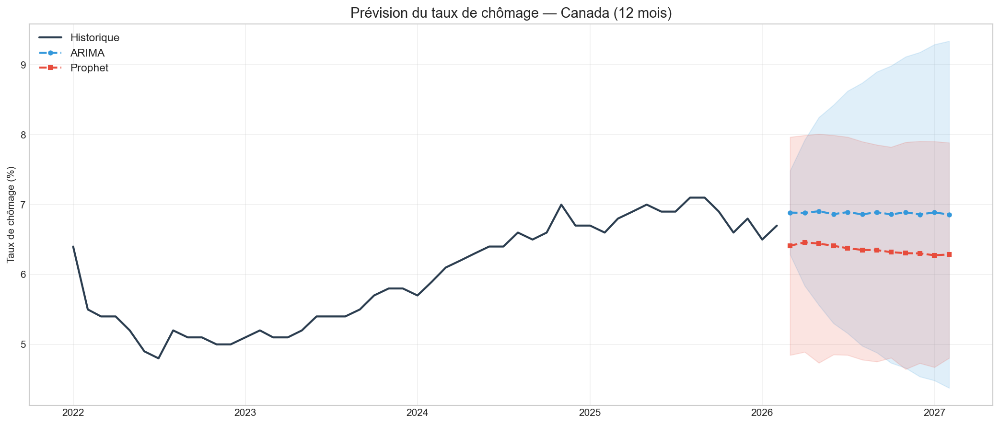

# Forecasting du taux de chômage canadien — ARIMA vs Prophet


Prévision du taux de chômage mensuel pour le Canada et ses 10 provinces en comparant plusieurs approches : ARIMA, SARIMAX (avec régresseurs), et Prophet.



## Résultat principal

| Modèle | Ordre | MAE | RMSE | MAPE (%) |
|--------|-------|-----|------|----------|
| **ARIMA** | (4, 1, 2) | 0.241 | **0.272** | 3.49 |
| Prophet | — | 0.478 | 0.503 | 6.93 |

ARIMA surpasse Prophet sur toutes les métriques pour le Canada, avec un RMSE presque deux fois plus faible (0.27 vs 0.50).

## Question de recherche

**Peut-on prévoir le taux de chômage canadien à 12 mois en utilisant des données publiques?**

## Données

- **Source** : Statistique Canada, Table 14-10-0287-03 — Caractéristiques de la population active
- **Régresseurs** : Taux directeur (Banque du Canada, API Valet) + IPC (variation annuelle)
- **Période** : 2000–2026 (données mensuelles, désaisonnalisées)
- **Géographies** : Canada + 10 provinces
- **Licence** : [Licence du gouvernement ouvert — Canada](https://ouvert.canada.ca/fr/licence-du-gouvernement-ouvert-canada)

## Méthodologie

| Modèle | Description | Forces |
|--------|-------------|--------|
| **ARIMA** | Auto-sélection des ordres (p,d,q) par AIC | Rigueur statistique, intervalles de confiance |
| **SARIMAX** | ARIMA + régresseurs (taux directeur, IPC) | Capture les dynamiques macro |
| **Prophet** | Décomposition tendance + saisonnalité + changepoints | Gestion des chocs (COVID-19, crise 2008) |
| **Prophet+** | Prophet + régresseurs externes | Combine flexibilité et variables macro |

### Évaluation
- Séparation train/test : 12 derniers mois réservés pour le test
- Cross-validation temporelle (5 folds, fenêtre glissante)
- Métriques : MAE, RMSE, MAPE
- Comparaison systématique sur les 11 géographies

## Structure du projet

```
projet-forecasting-chomage/
├── notebooks/
│   ├── 01_exploration.ipynb          # EDA + téléchargement StatCan
│   ├── 02_nettoyage.ipynb            # Nettoyage + séparation train/test
│   ├── 03_modelisation.ipynb         # ARIMA vs Prophet — entraînement + évaluation
│   ├── 04_visualisation.ipynb        # Graphiques finaux + prévisions futures
│   ├── 05_cross_validation.ipynb     # Cross-validation temporelle (5 folds)
│   └── 06_regresseurs_externes.ipynb # SARIMAX + Prophet avec taux directeur et IPC
├── app.py                            # Dashboard Streamlit interactif
├── scripts/update_data.py            # Mise à jour automatique des données StatCan
├── src/utils.py                      # Fonctions réutilisables
├── data/raw/                         # Données brutes StatCan
├── data/processed/                   # Données nettoyées
├── outputs/figures/                  # Graphiques exportés
└── requirements.txt
```

## Exécution

```bash
# 1. Installer les dépendances
pip install -r requirements.txt

# 2. Exécuter les notebooks dans l'ordre (01 → 06)

# 3. Lancer le dashboard interactif
streamlit run app.py

# 4. Mise à jour mensuelle des données
python scripts/update_data.py
```

## Dashboard Streamlit

Le dashboard permet de :
- Sélectionner une province et un horizon de prévision
- Comparer ARIMA et Prophet en temps réel
- Explorer les données interprovinciales

## Limites et prochaines étapes

### Limites
- Les régresseurs externes (taux directeur, IPC) doivent être connus ou prévus pour les prévisions futures
- Le choc COVID-19 déforme les patterns historiques et peut biaiser les prévisions
- Modèles univariés/bivariés — pas de modèle structurel complet

### Prochaines étapes
- Ajouter des régresseurs supplémentaires (offres d'emploi, indice avancé)
- Tester des modèles deep learning (LSTM, NeuralProphet)
- Déployer le dashboard sur Streamlit Cloud

---

[](https://ouvert.canada.ca/fr/licence-du-gouvernement-ouvert-canada)
